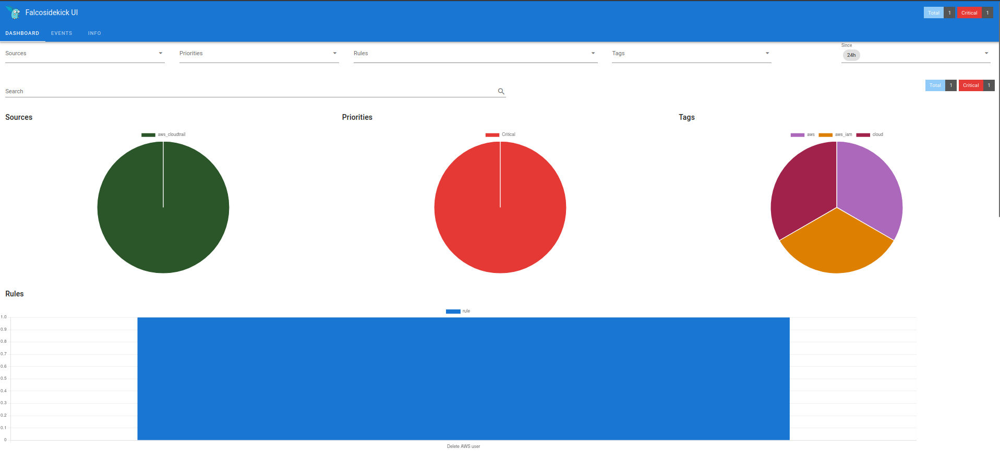
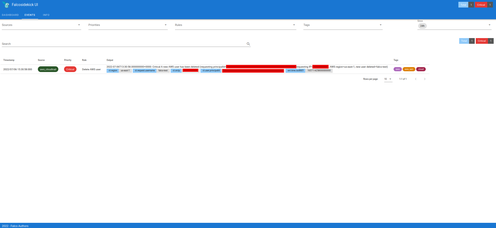
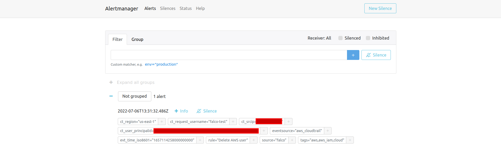
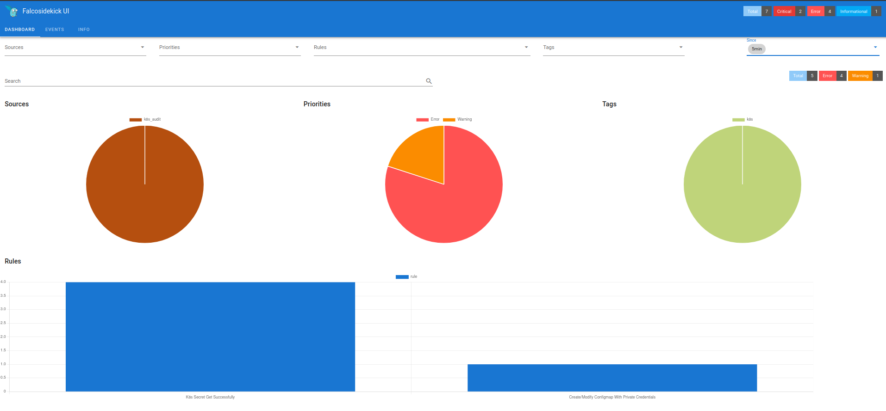
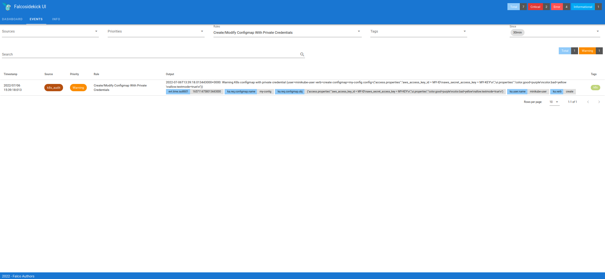
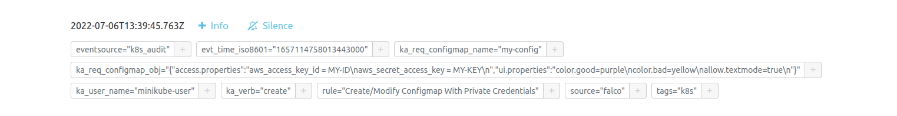

# Falco
# Prerequisites
* Minikube
* Helm
* Kubectl
* Export your AWS credentials

## Configure environment
```sh
# Deploy Terraform Code
$ ./falco.sh -a terraform

# Deploy minikube
$ ./falco.sh -a minikube
```

## Deploy Cloudtrail CU
```sh
# Deploy releases
$ ./falco.sh -a cloudtrail

# Access to Alertmanager
$ kubectl -n kube-prometheus-stack get ing
Example: `alertmanager.192.168.59.157.nip.io`

$ kubectl -n falco get ing
Example: `falcosidekick-ui.192.168.59.157.nip.io`
```
## Show Rules
* [Cloudtrail Rules](./helm-values/falco-cloudtrail.yaml#L47-L114)

## Run test
```sh
# Create User
aws iam create-user --user-name falco-test

# Delete user
aws iam delete-user --user-name falco-test
```

* Cloudtrail Falcosidekick Dashboard


* Cloudtrail Falcosidekick Events


* Cloudtrail Alertmanager


## Check Falcosidekick and Alertmanager
## Deploy Kubernetes Audit CU
```sh
# Deploy releases
$ ./falco.sh -a k8s-audit

# Create object
$ kubectl apply -f audit/configmap.yaml
```

* k8s_audit Falcosidekick Dashboard


* k8s_audit Falcosidekick Events


* k8s_audit Alertmanager


## Event example
```
{"kind":"Event","apiVersion":"audit.k8s.io/v1","level":"RequestResponse","auditID":"158438ad-859c-43c7-8646-f33eb9dadbb1","stage":"ResponseComplete","requestURI":"/api/v1/namespaces/default/configmaps?fieldManager=kubectl-client-side-apply","verb":"create","user":{"username":"minikube-user","groups":["system:masters","system:authenticated"]},"sourceIPs":["192.168.59.1"],"userAgent":"kubectl/v1.23.5 (linux/amd64) kubernetes/c285e78","objectRef":{"resource":"configmaps","namespace":"default","name":"my-config","uid":"b4952dc3-d670-11e5-8cd0-68f728db1985","apiVersion":"v1"},"responseStatus":{"metadata":{},"code":201},"requestObject":{"kind":"ConfigMap","apiVersion":"v1","metadata":{"name":"my-config","namespace":"default","selfLink":"/api/v1/namespaces/default/configmaps/my-config","uid":"b4952dc3-d670-11e5-8cd0-68f728db1985","creationTimestamp":"2016-02-18T18:52:05Z","annotations":{"kubectl.kubernetes.io/last-applied-configuration":"{\"apiVersion\":\"v1\",\"data\":{\"access.properties\":\"aws_access_key_id = MY-ID\\naws_secret_access_key = MY-KEY\\n\",\"ui.properties\":\"color.good=purple\\ncolor.bad=yellow\\nallow.textmode=true\\n\"},\"kind\":\"ConfigMap\",\"metadata\":{\"annotations\":{},\"creationTimestamp\":\"2016-02-18T18:52:05Z\",\"name\":\"my-config\",\"namespace\":\"default\",\"resourceVersion\":\"516\",\"selfLink\":\"/api/v1/namespaces/default/configmaps/my-config\",\"uid\":\"b4952dc3-d670-11e5-8cd0-68f728db1985\"}}\n"}},"data":{"access.properties":"aws_access_key_id = MY-ID\naws_secret_access_key = MY-KEY\n","ui.properties":"color.good=purple\ncolor.bad=yellow\nallow.textmode=true\n"}},"responseObject":{"kind":"ConfigMap","apiVersion":"v1","metadata":{"name":"my-config","namespace":"default","uid":"8865fdb5-541d-4bc2-b6f7-dd1e6ff7db6b","resourceVersion":"4177","creationTimestamp":"2022-07-05T13:10:19Z","annotations":{"kubectl.kubernetes.io/last-applied-configuration":"{\"apiVersion\":\"v1\",\"data\":{\"access.properties\":\"aws_access_key_id = MY-ID\\naws_secret_access_key = MY-KEY\\n\",\"ui.properties\":\"color.good=purple\\ncolor.bad=yellow\\nallow.textmode=true\\n\"},\"kind\":\"ConfigMap\",\"metadata\":{\"annotations\":{},\"creationTimestamp\":\"2016-02-18T18:52:05Z\",\"name\":\"my-config\",\"namespace\":\"default\",\"resourceVersion\":\"516\",\"selfLink\":\"/api/v1/namespaces/default/configmaps/my-config\",\"uid\":\"b4952dc3-d670-11e5-8cd0-68f728db1985\"}}\n"},"managedFields":[{"manager":"kubectl-client-side-apply","operation":"Update","apiVersion":"v1","time":"2022-07-05T13:10:19Z","fieldsType":"FieldsV1","fieldsV1":{"f:data":{".":{},"f:access.properties":{},"f:ui.properties":{}},"f:metadata":{"f:annotations":{".":{},"f:kubectl.kubernetes.io/last-applied-configuration":{}}}}}]},"data":{"access.properties":"aws_access_key_id = MY-ID\naws_secret_access_key = MY-KEY\n","ui.properties":"color.good=purple\ncolor.bad=yellow\nallow.textmode=true\n"}},"requestReceivedTimestamp":"2022-07-05T13:10:19.960188Z","stageTimestamp":"2022-07-05T13:10:19.964977Z","annotations":{"authorization.k8s.io/decision":"allow","authorization.k8s.io/reason":""}}
```
